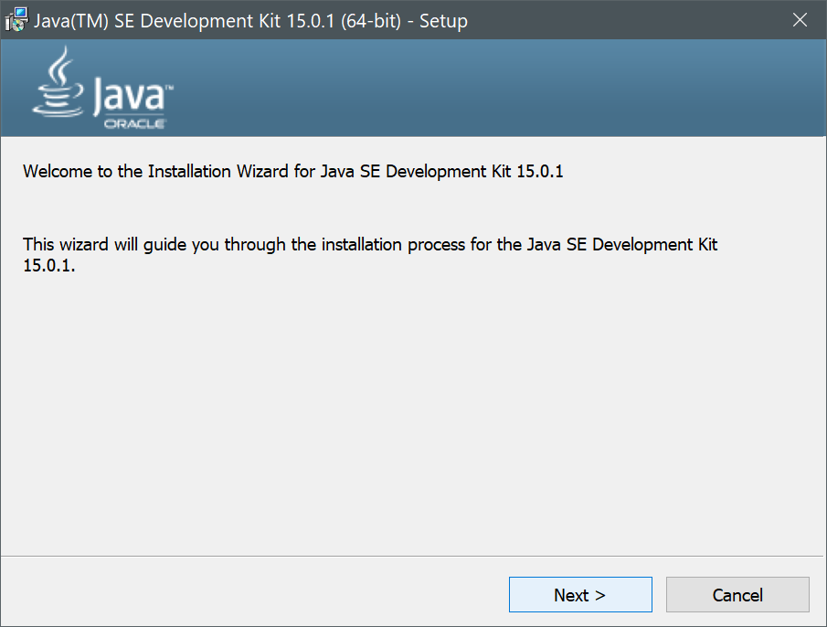
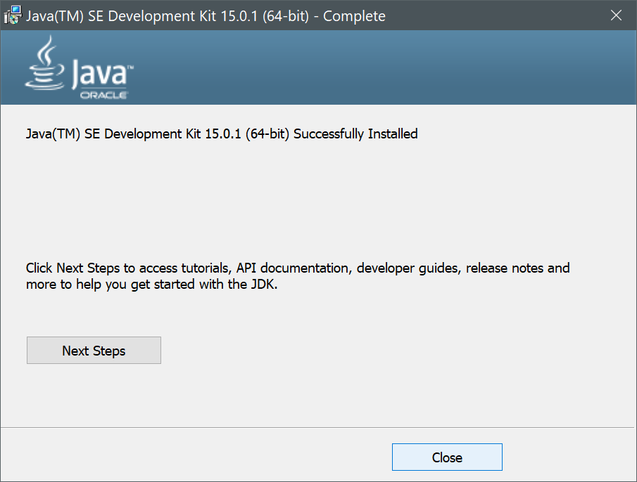

# **Java Installation Debugging**

**If you see that there is a reference to Java 15.0.1 it was made when that was the most recent version, just replace that with Java 15.0.2 in the images, I will update them later**

Unlike COMP1000, where you used the Processing IDE, 1010 focuses on the broader Java language, Processing uses it's own branch of Java integrated into the program itself so no other setup is required. Although you may encounter some issues when trying to setup your development environment with either Eclipse or Visual Studio Code. These instructions were made for Windows, I will add notes for MacOS later, but with Eclipse the processes are pretty much the exact same.

## **Installing Java**

* [Oracle Java 15.0.2 JDK](https://download.oracle.com/otn-pub/java/jdk/15.0.2%2B7/0d1cfde4252546c6931946de8db48ee2/jdk-15.0.2_windows-x64_bin.exe)
* [Eclipse Installer](https://www.eclipse.org/downloads/download.php?file=/oomph/epp/2020-09/R/eclipse-inst-jre-win64.exe&mirror_id=1051)

First you should open Command Prompt or your equivalent terminal application and run `java -version`. Depending on the following output you should attempt the following:

```
C:\Users\Test>java -version
'java' is not recognized as an internal or external command,
operable program or batch file.
```

If it doesn't come up with an error but instead displays information tied to an existing install that does not match the Java 15.0.2 you are trying to install then try the following:

```
java version "1.8.0_XXX"
<More information about installed version>
```

1. Run the executable you downloaded for the Java JDK.
2. Click `Next >` on this screen.



3. Make sure you're installing in the program files directory, if elsewhere record the directory or change it. Then clicking `Next`.


4. Wait for the installation process to conclude and then press `Close`.



5. Run the `java -version` command again and see what it outputs

```
C:\Users\Test>java -version
java version "15.0.2" 2020-10-20
Java(TM) SE Runtime Environment (build 15.0.2+9-18)
Java HotSpot(TM) 64-Bit Server VM (build 15.0.2+9-18, mixed mode, sharing)
```

This is the correct output if the given installation is properly installed. Sometimes the system variables may still not be set up properly, so you should continue with the following:

6. When you have your windows search bar open type type `env` and choose `Edit the system environment variables`. Once open click on the `Environment Variables…` button.


7. Edit the `User variables` section from the `Path` group and edit or add the line for Java to have the path of `C:\Program Files\Java\jdk-15.0.2\bin`.

8. Edit or add the following entry in `System vairables` for `JAVA_HOME` with the path to the installed JDK as follows:


Before checking the Command Prompt again, make sure to close it to let it refresh the terminal. Then run the command again.

## **Installing Eclipse**

When you run the installer application, you will be presented with a number of versions that are available. Make sure you pick `Eclipse IDE for Java Developers`.


When on the next screen you should see an option for `Java 11+ VM`, this shows that Eclipse requries atleast 11+, so if you have 1.8 (which is really 8, then it wouldn't work).


From the System category choose the JDK 15.0.2 option or find it through the `Browse...` option. Then choose your `Installation Folder`. Then choose the `INSTALL` option.


Make sure you select the appropriate folder for your projects and set as default.


## **Running Eclipse**

**If when you run the eclipse executeable and this error occurs:**


**Then go to your eclipse install folder and right click on the `eclipse.ini` file and hit "Edit" and add this section to the ***start*** of the file.**


```
-vm
C:\Program Files\Java\jdk-15.0.2\bin\javaw.exe
```

When the actual window is open, go to the toolbar and select `Windows > Preferences`. Then from the list select `Java > Installed JREs`.


Since our installed version of 15.0.2 is not in the list, go to `Add`, then select `Standard VM` from the options list. Then fill out the box for `JRE home` as the path to the JDK `C:\Program Files\Java\jdk-15.0.2`. The other fields should fill automatically, then hit `Finish`.


Select the box next to the JDK 15.0.2 instance and choose `Apply and Close`. Additionally you can remove all other instances of JREs unless specifically installed for another project.


Now when you create a new project with `File > New > Java Project` you should be able to select the option in the first menu to `Use default JRE` as follows:

However if you used a previous workspace without cleaning it out, then you may see an error like at the bottom, creating a new folder or deleting all the contents will resolve this error but all your preferences will be reset to factory defaults, like the theme colour.


To make sure it works, give your project a name in `Project name`, then click `Finish`. When a window asking about creating a "module info" file, make sure to always it `Don't Create`.


Right-click on the `src` folder add choose the `New > Class` option and fill as following:


Write the following program in the class file:

```java
public class Test {

	public static void main(String[] args) {
		System.out.println("Hello world!");
	}

}
```

Make sure `Test` matches the word in `Test.java`, so it is `FirstProject.java` the public class should be titled `FirstProject`. Then save the file and hit the run button.


## **Adding JUnit**

If you want to add the JUnit library to your own projects like used in the practice packages, assignments and exams, you can do the following:

1. Right-click on the project and select `Properties`
2. Select the option for `Java Build Path`.
3. Click on the `Libraries` tab and then the `Modulepath` option to enable the buttons.


4. Click on `Add Library...` option.
5. Select `JUnit` from the list, hit `Next >` and then `JUnit 5` from the dropdown.
6. Hit `Apply and Close` until you're back at the project view, which should now say:


### Hope this helps!
